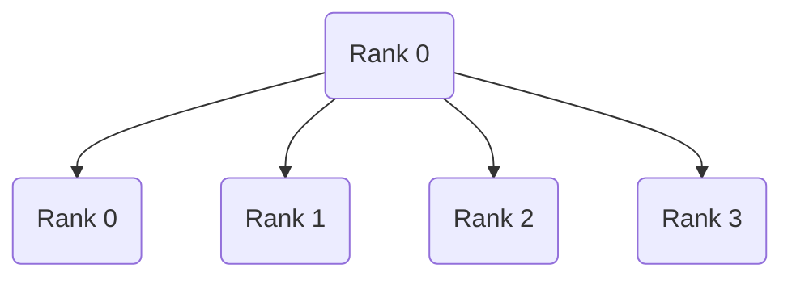

```torch.distributed.broadcast``` 是 PyTorch 分布式训练中最基础、最常用的通信原语之一，主要用于 把一个进程（rank）上的张量广播到同一进程组里的所有其他进程。

```python3
def broadcast(
    tensor: torch.Tensor,
    src: Optional[int] = None,
    group: Optional[ProcessGroup] = None,
    async_op: bool = False,
    group_src: Optional[int] = None,
):
```



## 参数

+ tensor

  要广播的张量（所有 rank 都必须提供同 shape / dtype 的 tensor）

+ src

  源进程的 rank（数据来自这个 rank）

+ group

  进程组，默认是 WORLD

+ async_op

  是否异步执行，返回 Work 对象


## 使用

### 基本使用：广播一个 Tensor

```python3
tensor = torch.zeros(3).cuda()

if rank == 0:
    tensor = torch.tensor([1., 2., 3.]).cuda()

dist.broadcast(tensor, src=0)

print(f"rank {rank}: {tensor}")
```

### 异步广播

```python3
work = dist.broadcast(tensor, src=0, async_op=True)

#
do_something()

work_wait()
```

## 典型使用场景

### 同步模型初始化参数

```python3
for param in model.parameters():
    dist.broadcast(param.data, src=0)
```

👉 确保所有进程的模型初始权重一致

### 2️⃣ 广播随机种子（保证可复现）

```python3
seed = torch.tensor([1234], device="cuda")

if rank == 0:
    seed = torch.tensor([torch.randint(0, 10000, (1,))], device="cuda")

dist.broadcast(seed, src=0)

torch.manual_seed(seed.item())
```

### 3️⃣ 广播配置信息 / 超参数

```python3
lr = torch.tensor([0.0], device="cuda")

if rank == 0:
    lr = torch.tensor([0.001], device="cuda")

dist.broadcast(lr, src=0)

```

### 4️⃣ Checkpoint 恢复时同步状态

```python3
if rank == 0:
    ckpt = torch.load("model.pt")
    state = ckpt["epoch"]
else:
    state = torch.zeros(1, dtype=torch.long)

dist.broadcast(state, src=0)

```
